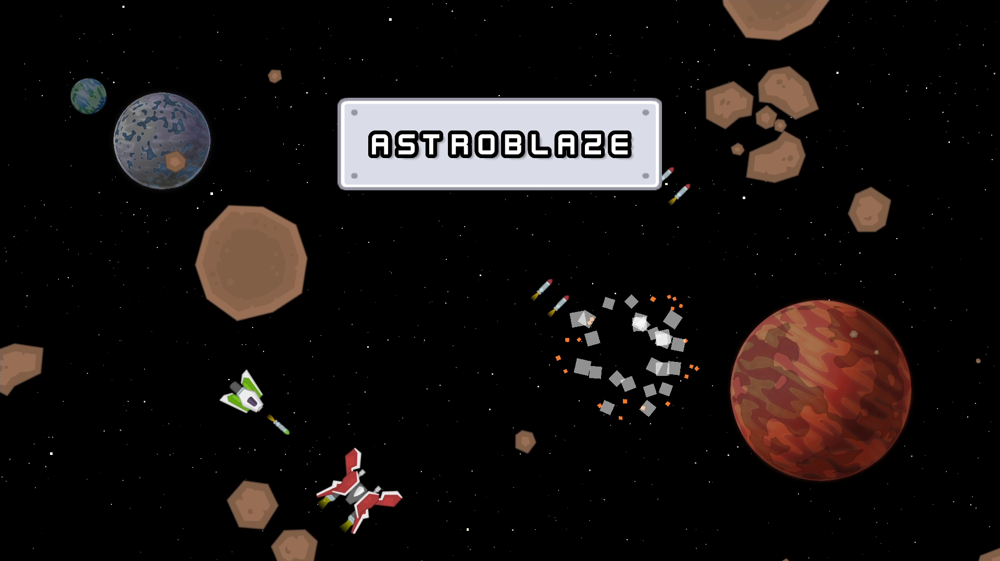

# AstroBlaze
AstroBlaze es un videojuego de acción espacial donde el jugador controla una nave. Deberá enfrentarse a enemigos y destruir asteroides, evitando chocar contra los fragmentos que se desprenden de ellos.
Tiene 3 niveles y el objetivo es obtener los puntos en el menor tiempo posible.

- Videojuego Web para la asignatura de Aplicaciones Web - GDA3DIV USAL - 2025
- Se puede jugar en el navegador en [Github Pages](https://espity.github.io/AstroBlaze/)
- El proyecto se ha realizado con Godot 4.5.1
- Desarrollado por [ESPITY](https://github.com/ESPITY)
- Créditos: assets y audios de [Kenney](https://kenney.nl/). Música de [Kevin MacLeod](https://incompetech.com/)

## Controles
- WASD / Flechas: moverse
- Espacio: disparar
- Escape / P: pausar

## Estructura de las carpetas del repositorio
- Resources: collisiones de los asteroides, temas de los botones y fuente (.tres, .tff)
- Scenes: las escenas del juego como la UI, el jugador, los asteroides, los enemigos, etc. (.tscn)
- Scripts: el código GDScript empleado en el juego (.gd)
- Sound: la música y efectos de sonido del juego (.wav, .tres)
- Sprites: las imágenes empleadas en el juego para los asteroides, el nivel, la UI, etc. (.png)
- docs: los archivos del juego exportado para Github Pages

## Cómo ejecutar el proyecto
### Opción 1: Github Pages (recomendado)
- Abrir el enlace del juego en [Github Pages](https://espity.github.io/AstroBlaze/) en el navegador

### Opción 2: XAMPP (servidor local)
- Instalar [XAMPP](https://www.apachefriends.org/es/index.html)
- Descargar la carpeta docs y guardarla en la carpeta `htdocs` de XAMPP
- Ejecutar xampp-control y Apache
- Acceder a la página del servidor local: http://localhost/docs/

> _NOTA: también se puede ejecutar en un servidor local con la extensión Live Server de VSCode o con Python_

### Opción 3: Proyecto de Godot
- Clonar el repositorio de AstroBlaze: `git clone https://github.com/ESPITY/AstroBlaze.git`
- Abrir una versión compatible de Godot e importar el archivo `project.godot`
- Ejecutar el proyecto